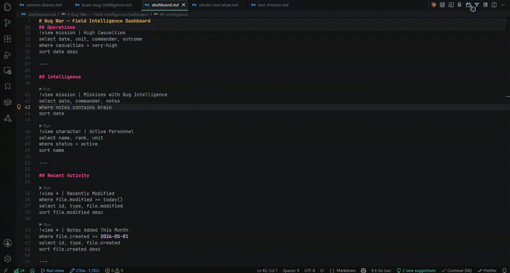
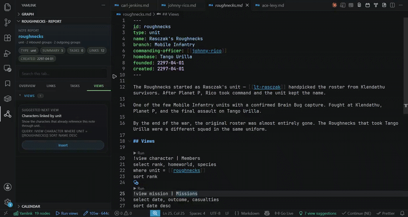
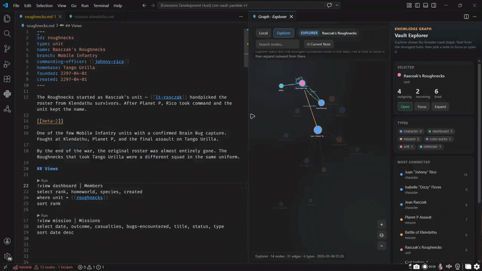

# Yamlink

Structured knowledge for Markdown, inside VS Code.

[](https://marketplace.visualstudio.com/items?itemName=yamlink.yamlink)


Yamlink turns a folder of Markdown files into a local-first knowledge system:

- notes get stable `id:` identities
- `[[wikilinks]]` become graph relationships
- YAML frontmatter becomes structured data
- `!view` blocks become live, editable tables
- side panels turn the vault into an operational workspace

Yamlink is built for people who want their notes to stay plain-text, Git-friendly, queryable, and local.

If you want the practical onboarding path, use [GETTING_STARTED.md](./GETTING_STARTED.md).

---

## New in Ace+

Ace+ is the trust-and-intelligence follow-up to Ace.

It strengthens the parts of Yamlink that were already central to the product promise:

- smarter suggested views
- stronger wikilink truth in the graph
- safer relation autocomplete
- better query-side relation completion
- broader quality-of-life and hardening work across tables, graph, report, calendar, and health

### Adaptive intelligence

Yamlink is now moving toward an adaptive intelligence model instead of isolated heuristics.

That means it increasingly learns from:

- frontmatter structure
- body and frontmatter wikilinks
- schema relation definitions
- observed field usage across the vault
- graph patterns

The goal is simple:

- keep a small set of foundational semantics
- let the user's vault teach the rest of the system

### Smarter suggestions and completions

Smart suggestions are no longer just repeated-backlink prompts.

Ace+ now pushes them toward:

- schema-backed suggestions even before repeated backlinks exist
- mixed-type relation awareness
- current-note relation context
- note-role-aware explanation when no suggestion qualifies yet

Autocomplete also got much stronger:

- frontmatter relation completion no longer blindfolds the user
- likely targets still rise first, but the rest of the vault stays visible
- query `where ... = [[` completion now follows the same target-preference model
- completion detail text explains more of Yamlink's reasoning directly

### Graph and truth

Body/frontmatter wikilinks are now canonicalized more aggressively before indexing.

That means links with:

- aliases
- heading anchors
- block refs
- casing or spacing differences

are much less likely to silently miss their real node in the graph.

---

## New in Ace

### Live tables

Editable query tables are now strong enough for real operational work. You can update typed cells, paste from spreadsheets, revert rows, and export views without leaving the editor.



### Note Report and Calendar

The Yamlink sidebar now gives the vault a real operational shell. Note Report helps you understand where a note sits in the system, and Calendar lets you review dated activity across the vault.



### Graph

The graph is no longer just a cloud of dots. It now has filtering, a map key, stronger spacing, node inspection, and a layout that makes relationships readable.



---

## Why It Matters

In my daily workflow, I don't want to work separately with:

- freeform writing
- structured databases
- graph relationships
- local ownership

So Yamlink tries to collapse those into one workflow inside the editor people already use.

With Yamlink, you can:

- write normal Markdown notes
- give notes stable identities with `id:`
- connect them with `[[wikilinks]]`
- query the vault with `!view`
- edit data inline in live tables
- inspect a note through Note Report
- track dated activity across the vault
- export notes and views to PDF

---

## What Changed In Ace+

`0.3.5 - Ace+`

Ace+ strengthens Ace (0.3.0) in the areas where the product promise most needed follow-through (that's on me, my bad):

- adaptive intelligence is now a real product track, not just a loose set of heuristics. This area was not properly revised/polished
- smart suggestions are broader, more explainable, and less brittle. THere's now more consistency for your daily workflow
- autocomplete is more transparent and less restrictive. I felt it was just too narrow, especially when your vault/personal schema wasn't fully established.
- body/frontmatter wikilink truth is much stronger
- query/table/graph/sidebar surfaces all received real quality-of-life and hardening work

Ace remains the shaping release.
Ace+ is the release line where that foundation gets smarter, safer, and more trustworthy.

---

## What Changed In Ace

`0.3.0 - Ace`

Ace adds or stabilizes:

- a real Yamlink sidebar with:
  - Note Report
  - Calendar
  - Vault Health
- much stronger query tables:
  - typed cells
  - bulk paste
  - row revert
  - PDF / CSV / JSON export
- smarter frontmatter and relation autocomplete
- stable task block IDs
- vault-wide calendar activity
- a much stronger graph surface
- broader reliability and test coverage

---

## Quick Start

### 1. Give a note an identity

```yaml
---
id: johnny-rico
type: character
name: Johnny Rico
unit: [[roughnecks]]
rank: lieutenant
created: 2297-01-15
---
```

### 2. Link notes together

```yaml
---
id: mission-klendathu
type: mission
date: 2297-08-01
commander: [[johnny-rico]]
unit: [[roughnecks]]
outcome: catastrophic-failure
---
```

### 3. Query the vault

```md
!view mission | Rico missions
where commander = [[johnny-rico]]
select date, unit, outcome
sort date desc
```

Run the view and Yamlink opens a live table beside your editor.

### 4. Open the side surfaces

Use the Yamlink sidebar to inspect:

- Note Report
- Calendar
- Vault Health

---

## Feature Highlights

### Core graph and identity

- Canonical `id:` model for Markdown notes
- Wikilinks in body text and frontmatter relations
- Backlinks and outgoing relation tracking
- Broken link diagnostics
- Duplicate ID diagnostics
- Rename propagation across the vault
- Multi-root workspace support

### Query system

- `!view` blocks inside Markdown
- Multiple query blocks in one note
- Type filters, `where`, `contains`, `sort`, `limit`
- Query labels with `| Name`
- Incoming relation queries
- Shortcut queries:
  - `!view today`
  - `!view upcoming`
  - `!view calendar`
- Guided query-builder foundation
- Smart query suggestions based on graph patterns

### Live tables

- Inline editable query tables
- Typed cells:
  - text
  - relation
  - boolean
  - dropdown
  - number
  - date
- Bulk spreadsheet-style paste
- Row-level revert
- Tab / Shift+Tab navigation
- Column controls and persistence
- Search, sort, and filter chips
- Export:
  - CSV
  - JSON
  - PDF

### Sidebar surfaces

- Note Report
- Vault-wide Calendar
- Vault Health
- Graph / relationship map

### Frontmatter intelligence

- Smart relation completions in frontmatter
- Observed-field fallback when schemas are absent
- Archetype-based field suggestions
- Relation target inference from field names and schema
- Fallback to all indexed notes when inference is weak

### Ace+ intelligence direction

- Shared field-role intelligence core
- First note-role inference layer
- Smarter suggestion generation from:
  - schema-backed relations
  - mixed-type relation patterns
  - current-note relation context
- Clearer explainability when suggestions are absent
- Query-side relation completion aligned with frontmatter relation completion
- More transparent completion detail text so users can understand inferred targets and field-role reasoning

### Tasks and date activity

- Stable task block IDs
- Task extraction from Markdown task lines
- Calendar month / week / day views
- Created-note activity in calendar
- Timeline context inside Note Report

### Export and sharing

- Export active note to PDF
- Export live table views to PDF
- Embed `!view` results into note PDF output

For the fuller capability reference, see [FEATURES.md](./FEATURES.md).
For setup guidance and recommended vault structures, see [GETTING_STARTED.md](./GETTING_STARTED.md).

---

## Example Workflows

### Knowledge system

- create stable note identities with `id:`
- link concepts, people, projects, or ideas with `[[wikilinks]]`
- inspect structure through Note Report, Graph, and backlinks

### CRM / operations

- model accounts, contacts, opportunities, or projects with frontmatter
- query them into live tables
- track follow-ups in Calendar
- export structured views to PDF for reporting

### Research / worldbuilding / longform writing

- keep dossiers, source notes, timelines, and chapter support notes in Markdown
- use Note Report as a contextual inspector while drafting
- use tables and queries to surface scenes, entities, unresolved links, or supporting material

---

## The Mental Model

```text
Markdown files  -> add id: fields  -> Nodes
Nodes           -> add [[links]]   -> Relations
Relations       -> form a          -> Graph
Graph           -> queried by      -> !view blocks
!view blocks    -> render as       -> Live tables
```

That is the whole system.

You can stop at any layer:

- use only IDs and links and you get rename-safe notes plus backlinks
- add `!view` and you get live databases
- add dates and tasks and you get planning surfaces
- add note reports and vault health and you get operational context

---

## Query Language

### Basic query

```md
!view mission
```

### Filtered query

```md
!view mission | Missions led by Rico
where commander = [[johnny-rico]]
select date, outcome, unit
sort date desc
limit 10
```

### Incoming relation query

```md
!view incoming mission
via commander
select date, outcome
```

### Supported clauses

| Clause | Example | Purpose |
|---|---|---|
| `select` | `select name, rank, unit` | choose and order columns |
| `where =` | `where unit = [[roughnecks]]` | exact field match |
| `where contains` | `where notes contains plasma` | substring filter |
| `sort` | `sort date desc` | ordering |
| `limit` | `limit 5` | trim result set |
| `via` | `via commander` | relation field filter for incoming views |
| `| label` | `!view mission | Latest` | custom tab name |

### Shortcut queries

```md
!view today
!view upcoming
!view calendar
```

These are currently task/date-oriented query shortcuts, while the sidebar Calendar is the richer vault-wide planning surface.

---

## Current Surfaces

### Note Report

The Note Report is Yamlink's structured inspector for the active note.

It currently shows:

- summary fields
- incoming links
- outgoing links
- task sections
- timeline context
- suggested views

### Calendar

The Calendar is vault-wide, not note-specific.

It currently supports:

- month view
- week view
- day view
- task activity
- created-note activity

### Vault Health

Vault Health gives a structured snapshot of:

- node count
- edge count
- broken links
- orphan nodes
- type distribution
- overall vault quality

### Graph

The graph is now a real product surface, not just a prototype canvas.

It includes:

- search
- type and relation filtering
- a map key
- a selected-node inspector
- stronger first-open layout and spacing

---

## Feature Status

### Strong today

- identity and link graph
- diagnostics and rename propagation
- query parsing and execution
- live editable tables
- frontmatter intelligence
- Note Report foundation
- vault-wide Calendar foundation
- Vault Health
- graph surface
- PDF export

### Still being polished

- Note Report smoothness during navigation
- Calendar density and responsiveness
- very large-vault performance
- task workflows beyond the current foundation
- simple query UX and builder depth
- broader date/time support

---

## Templates, IDs, and Dates

### Templates

Yamlink already supports `_templates/`-based note creation, which is one of the most important foundations for custom vault design.

Templates currently allow users to:

- create notes from Markdown templates
- shape custom frontmatter structures
- set up repeatable note types for CRM, research, worldbuilding, and ops

Templates are already useful today, and they are an important part of Carmen's roadmap.

### ID Policy

Yamlink IDs are canonical machine IDs, not display labels.

Recommended:

```text
johnny-rico
mission-klendathu
crm-contact-alfa
note-report-test
```

Rules:

- lowercase kebab-case is strongly recommended
- letters, numbers, `_`, and `-` are safe
- use `name` or `title` for human-facing labels
- accented input can be normalized into safe canonical IDs

Examples:

- `Jaime Ramirez` -> `jaime-ramirez`
- `Jaime Ramírez` -> `jaime-ramirez`

### Dates

Today, Yamlink stores and renders dates canonically as:

```text
YYYY-MM-DD
```

That keeps:

- sorting predictable
- queries reliable
- round-tripping safe
- tables stable

Yamlink has already begun broader date parsing work, but canonical ISO-style storage remains the rule for now.

This matters especially for:

- CRM workflows
- operational follow-ups
- long-lived planning systems

---

## PDF Export

Yamlink can export:

- live view tables to PDF
- the active note to PDF

Note export currently includes:

- summary/frontmatter data
- note body content
- embedded `!view` results

That makes Yamlink useful not just for in-editor work, but also for reporting and sharing.

---

## Longform Writing Direction

Yamlink is not just a graph/database tool.

It can also become a strong Markdown-native companion for:

- books
- reports
- research dossiers
- proposals
- worldbuilding
- CRM-style narrative work

The direction here is:

- support structure first
- support references and linked context
- support writer dashboards and drafting workflows
- avoid adding rich-text chrome unless it clearly beats VS Code defaults

---

## Install

Install from the VS Code Marketplace:

[Yamlink on the Marketplace](https://marketplace.visualstudio.com/items?itemName=yamlink.yamlink)

Or search for `Yamlink` inside VS Code.

On first activation, Yamlink can copy a sample vault into your workspace so you can explore the model immediately.

---

## Sample Vault Files

The `sample/` folder exists so demos and manual testing stay repeatable.

Useful examples:

- `dashboard.md`
- `query-shortcuts.md`
- `table-types.md`
- `note-report.md`
- `tasks-calendar.md`

---

## Roadmap Snapshot

### `0.3.0 - Ace`

Ace is the shaping release:

- dependable indexing
- stronger tables
- sidebar surfaces
- graph brought up to product quality
- better export and document structure

### `0.3.x - Ace+`

Ace+ is the refinement and trust release:

- intelligence overhaul
- stronger link truth
- safer autocomplete
- broader QOL and hardening

### `0.4.0 - Carmen`

Carmen should be about:

- scale
- polish
- hardening
- quality-of-life improvements
- only a few small, high-leverage features

Likely Carmen priorities:

- smoother Note Report behavior
- tighter Calendar responsiveness and planning UX
- stronger large-vault performance
- better query-builder and simple query UX
- task workflow refinement
- broader date/time support
- stronger template workflows for custom vault creation


---

## Philosophy

Yamlink is trying to prove that structured work does not have to begin in a locked platform.

It can begin in:

- Markdown
- YAML
- Git
- VS Code

And from there, grow only when the user is ready.


*Would you like to know **more?***

---

## License

MIT
