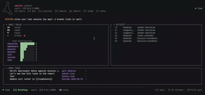
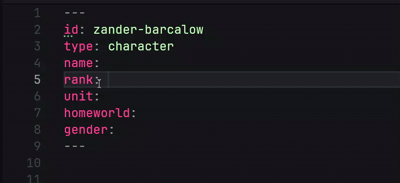
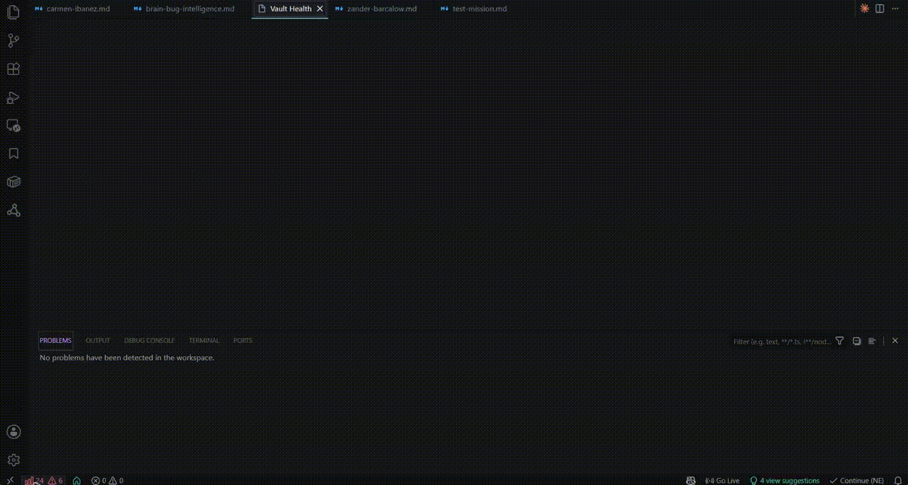

#  Yamlink

Wikilinks, backlinks, knowledge graph, and live query tables — all inside VS Code, all plain Markdown files.

[](https://github.com/Yamlink-Labs/yamlink/actions/workflows/ci.yml)
[](https://marketplace.visualstudio.com/items?itemName=yamlink.yamlink)
[](https://marketplace.visualstudio.com/items?itemName=yamlink.yamlink)
[](https://marketplace.visualstudio.com/items?itemName=yamlink.yamlink)


Yamlink turns a folder of Markdown files into a structured knowledge system inside VS Code. Notes get stable `id:` identities that survive renaming. `[[wikilinks]]` become typed graph edges. YAML frontmatter becomes queryable structured data. `!view` blocks run live queries and open editable tables — edit a cell and it writes back to the source file.

No database. No sync. No locked platform. Your files stay plain Markdown and work in any editor.

VS Code is the flagship Yamlink experience. Sugar (0.7.0) extends the platform beyond the editor: a full-featured CLI, a keyboard-driven terminal UI (Conduit), and an the early stages of an LSP server that will open the door for expansion into other platforms.

If you want the practical start, see [GETTING_STARTED.md](./GETTING_STARTED.md).  
Want a real vault to explore immediately? See [Yamlink Sandbox](https://github.com/Yamlink-Labs/yamlink-sandbox).  
For the full query language and usage, see [QUERY_LANGUAGE.md](./QUERY_LANGUAGE.md).  
New to Yamlink's terminology? See [GLOSSARY.md](./GLOSSARY.md).  
To understand the intelligence system, what the lightbulbs mean, and how Yamlink learns: see [INTELLIGENCE.md](./INTELLIGENCE.md).

---

## What it looks like

### A Yamlink note

<!-- hero screenshot: open sample/yamlink-hero.md in VS Code with Yamlink Apollo Night theme, capture the editor at ~1400px wide, replace hero.png -->

| | |
|---|---|
| **Frontmatter** | Structured YAML at the top of every note. Fields like `platform: [[vs-code]]` are typed graph edges — Yamlink indexes, completes, and renames them vault-wide. |
| **`[[wikilinks]]`** | Every link becomes a graph edge. Ctrl+Click navigates, completions rank by type, broken links surface as diagnostics. Rename a note — every link updates automatically. |
| **Block references** | Every meaningful body element has a stable block ID: `h-{slug}` for headings, `t{n}-{hash}` for tasks, `q{n}-{hash}` for blockquotes, `fn-{id}` for footnotes. Write `note#Heading` to link a section or `note^block-id` to link a specific task, quote, or footnote. Go-to-definition lands on the exact line. |
| **Callouts** | `> [!INFO]` `> [!TIP]` `> [!WARNING]` — body structure signals that feed note-role inference and the Note Report. |
| **Tasks** | `- [ ]` checkboxes extracted from the note body, tracked in the Calendar by due date, surfaced in Home, and queryable with `!view open-tasks`. |
| **`!view` block** | A live query written inline in the note. Runs against the vault, opens an editable table beside the editor. Edit a cell — it writes back to the source Markdown file. |
| **Tags** | `#local-first #pkm` — body hashtags and frontmatter tags, both filterable in queries with `where #pkm`. |

### Live tables

Write a `!view` block. Run it. A live table opens beside your note — editable cells, typed values, per-column filters, sort, search, export. Edits write back directly to frontmatter.


### Conduit

Conduit is Yamlink's keyboard-driven terminal workspace. Run `yamlink` and your vault opens in the terminal — nine screens accessible by number key: Briefing, Query, Navigator, Explorer, Health, Search, Graph, Diff, Radar. Browse notes, run live queries, capture, edit frontmatter, and read full notes without leaving the terminal. Press `|` to split into two independent panes sharing one live vault connection.



### Intelligence completion

Yamlink learns your vault's structure and ranks field suggestions from what similar notes look like and which completions you've accepted before. On a relation field, type `[[` and ranked candidates appear filtered to the right type. The Note Report Overview tab shows arc-predicted missing fields — ranked by how often they appear on notes of the same type that yours is missing.



### Note Report and Calendar

Note Report shows where a note sits in the system: its connections, lifecycle state, tasks, and what views make sense next. Calendar surfaces dated activity across the vault without leaving the editor — task due dates, note `date:` fields, and created-note activity all land there.


### Graph

Two surfaces in the extension: the sidebar shows the full vault at a glance — note types color-coded, hub notes rising by connection count. Graph Workspace opens a focused explorer centered on the current note.

x-graph is the underlying engine: Canvas2D + D3-force, no third-party graph library. Three layers — base topology, semantic edge coloring by relation type, health rings by lifecycle/drift state. Nodes are draggable with live physics.


### Vault Health

A full-vault audit in one panel. Broken links, duplicate IDs, schema violations, orphaned notes, and lifecycle drift — all surfaced instantly, with one-click navigation to the offending note. Keep your knowledge base clean as it grows.



---

## The model

Three things. One loop.

**Identity** — every note that matters gets a stable `id:`:

```yaml
---
id: johnny-rico
type: character
name: Johnny Rico
unit: [[roughnecks]]
rank: lieutenant
created: 2297-01-15
---
```

**Relations** — frontmatter links and body wikilinks feed the same graph:

```yaml
---
id: mission-klendathu
type: mission
date: 2297-08-01
commander: [[johnny-rico]]
unit: [[roughnecks]]
casualties: high
outcome: catastrophic-failure
---
```

**Queries** — `!view` blocks inside your notes run against the live graph:

```
!view mission | Rico's missions
where commander = [[johnny-rico]]
select date, unit, outcome
sort date desc
```

Run the view. A table opens beside the note. Edit a cell. It writes back to the source file.

**The loop: write → link → query → inspect → refine.**

If you do not want to hand-write the query first, run `Yamlink: Query Builder`. It opens a compact visual builder panel for table views, incoming/backlink views, and task presets, while still showing you the exact generated `!view` text before it inserts or replaces anything.

The current builder flow is:

- `View` — choose the query family first
- `Shape` — set type, columns, filters, layout, sort, and optional details with progressive disclosure
- `Preview` — inspect sample rows, warnings, and the exact query before insertion

The panel is built to stay text-first rather than replace the language:

- `Recommended / All fields / Custom` column modes
- collapsible `Result layout`, `Filters`, `Sort & limit`, and `Details` sections
- icon-based layout choices for table, matrix, bar, and scatter
- sample rows rendered like the real result, not raw metadata
- a live preview status line so the panel tells you when the query is ready to insert

---

## Sugar (0.7.0)

Sugar is the current release lane. It expands Yamlink in two directions at once:

- a stronger VS Code authoring experience
- a real platform outside the editor through CLI, API, Conduit, and LSP

In the editor, Sugar now includes:

- **Smart Templates** that act as a staged authoring flow instead of a basic scaffold drop
  - type-aware setup actions such as `Use the character schema from Smart Templates`
  - learned schema insertion
  - cursor handoff into the next unresolved field
  - follow-up completion that can reopen automatically for strong relation or scalar suggestions
- **Block and section references — sub-note precision linking**
  - every heading, task, blockquote, and footnote has a computed block ID
  - section references: `note#Heading Text` links to a specific heading by its anchor
  - block references: `note^block-id` links to a specific task, quote, or footnote (e.g. `note^t1-3f2a1b`, `note^fn-source`)
  - six commands: Copy/Insert Section Reference, Copy/Insert Block Reference, Copy/Insert Scoped Reference — cursor-aware, no picker needed when you're already on the block
  - go-to-definition navigates to the exact body line, not just the file
  - hover shows the referenced block's content inline in the card
  - `note^` triggers completion with the full block index: type labels, block IDs, and line numbers
  - Note Report outbound link list shows the resolved block label for each block reference
  - LSP surfaces the same precision navigation for Zed, Helix, and Neovim users
- **Visual Query Builder** - v1
  - compact `View -> Shape -> Preview` flow
  - table, incoming, and task presets
  - matrix, bar, and scatter layout options
  - live generated `!view` preview before insertion
- **Live Note mode**
  - `Yamlink: Open Live Note`
  - compact rendered sidecar that stays synced while you keep editing the source note
  - source-jump actions on frontmatter fields, headings, and Yamlink view blocks
  - themed to sit on VS Code's own surface instead of pretending to be a separate app
- **Mutation-aware intelligence**
  - recent accepted structure work now feeds live relation ranking instead of only appearing in history panels
  - relation completion can bias toward the target types and concrete notes the vault has been modeling lately
  - low-history fields can recover relation intent from recent behavior before long-term vault statistics fully catch up
- **Task management refinement**
  - Home task groups
  - Calendar task/date activity
  - per-vault task notifications for overdue and due-today work
- **Import depth**
  - Obsidian import strengthening
  - first-pass Roam, Notion, and Evernote import flows
  - post-import cleanup actions for IDs and wikilinks
- **Outline refinement**
  - richer Note Outline metadata
  - search and filter controls
  - current-section tracking for long notes

Outside VS Code, Sugar also brings the full platform layer forward:

- **CLI (22 commands)** — build, health, validate, query, report, briefing, status, search, doctor, diff, mutations, create, rename, watch, on, serve, conduit, graph, export, schema, completions, init
- **Local API** through `yamlink serve` — writable REST endpoints, events stream, tasks, mutations, intelligence snapshots
- **Conduit** — the keyboard-driven terminal workspace with 9 screens: Briefing, Query, Navigator, Explorer, Health, Search, Graph, Diff, Radar. `yamlink` alone launches Conduit with auto-serve. `|` splits the view into two independent panes so you can run a query while browsing notes, or hold two screens open simultaneously. `v` opens a full Markdown reading view with ANSI rendering, `j`/`k` scroll, and `]`/`[` heading navigation.
- **LSP** through `yamlink serve --lsp` — completion, hover, rename, diagnostics, formatting, inlay hints, semantic tokens, code actions, incremental document sync, and stale-edit protection for non-VS Code editors

For the detailed release-by-release history, see [CHANGELOG.md](./CHANGELOG.md) and [WHATS_NEW.md](./WHATS_NEW.md).

---

## Features

### Graph

- canonical `id:` model — stable across renames, renames propagate vault-wide
- body and frontmatter wikilinks in the same graph
- display aliases (`[[id|Label]]`) and vault aliases (`aliases:` in frontmatter)
- embeds (`![[id]]`): dimmed decoration, Ctrl+Click navigation, broken-link diagnostics
- broken `[[links]]` decorated with amber brackets + faded amber text — readable signal, no squiggle
- broken link quick fix walks through the template workflow: pick from existing templates (type-matched floats to top) or let Yamlink scaffold a starter
- broken link and duplicate ID diagnostics with quick-fix actions
- Graph 2.0: sidebar constellation + Graph Workspace with filters, search, isolate, and minimap

### x-graph (flagship)

Yamlink's custom graph engine — Canvas2D renderer + D3-force physics, built from scratch. Designed as a layered visualization system.

Three independent visual layers that stack:

- **Base** — nodes sized by hub score, kind-colored, hover dims non-neighbors, click pins focus, drag repositions nodes with live physics
- **Semantic** — edges colored by relation type (person/teal, event/amber, topic/purple, container/blue), direction arrowheads, dashed weak links
- **Health** — rings around nodes encode lifecycle state (hub → stale) and structural drift (minor-drift → outlier), with the health legend expanding inline


### Query

- `!view` blocks inside Markdown notes
- one-line and multi-line power-user forms, multiple blocks per note
- `where`, `contains`, `sort`, `limit`, `via`, `group by`, `| label`
- `!=`, `is empty`, `exists`, `is not empty`
- cross-field OR: `where status = active or type = contact`
- `#tag` shorthand: `where #crm and status = active`
- date functions: `today()`, `days-from-now(n)`, `days-ago(n)` and more
- **`file.created` / `file.modified`** — virtual fields from the file system; filter notes by when they were created or last touched without adding anything to frontmatter (`where file.created >= 2026-01-01`)
- incoming relation queries: `!view incoming mission via commander`
- shortcut queries: `!view today`, `!view upcoming`, `!view open-tasks`, `!view overdue`

### Tables

- editable cells: text, relation, boolean, dropdown, number, date
- bulk spreadsheet-style paste, row-level revert, undo
- per-column value filters, client-side sort, column hide/show, drag-to-reorder
- **matrix view** — toggle any `!view` table to a two-axis grid: rows = query results, columns = any vault type, cells show connections (●)
- **bar chart** — click **Bar** in the layout toggle to group any result by any field; a **Group by** picker appears in the toolbar. Queries already using `group by` render immediately. Ideal for category distributions: notes per status, missions per outcome, contacts per account.
- **scatter chart** — click **Scatter** to plot results as data points on an X/Y grid. Yamlink auto-selects the first two numeric or date fields as axes; use the axis dropdowns to change them. The button is greyed out when the result has no numeric or date fields.
- task status pills: Done, Not done, Due today, Due soon, Overdue
- export: CSV, JSON, PDF

### Intelligence

- type-filtered relation completion — a `contact:` field only shows `contact` notes
- `New [type]` note creation from relation fields — creates the note, wires both sides
- schema-driven note creation (`yamlink.newNoteFromSchema`)
- note creation priority: Template → Schema → vault inference → bare stub
- vault-derived field bundle suggestions over hardcoded archetypes
- **feedback loop** — the system also learns from completions you accept: accepting a relation suggestion writes a training signal to the mutation log; that history boosts confidence in future predictions for the same field
- **note arc prediction** — shows which fields similar notes typically have that yours doesn't, ranked by vault frequency and your acceptance history
- lifecycle state: `draft`, `growing`, `consolidated`, `hub`, `stale`
- type consistency: `on track`, `slightly unusual`, `missing structure`, `very unusual`
- `@today`, `@tomorrow`, `@thisweek`, and other date shortcuts in frontmatter
- **quick capture** — `Ctrl+Alt+N` / `Cmd+Alt+N` creates a new note without breaking editor flow; when triggered from inside a Yamlink note, offers to link the new note back to the current one (L3 contextual linking)
- **auto-date stamp** — new notes get `created:` written at creation time; `Yamlink: Add Missing Creation Dates` stamps existing notes from file system birthtime

### Surfaces

- **Home** — activity feed, vault pulse, continue-working, nudge cards, and operational task groups (overdue, today, upcoming, open / undated)
- **Note Report** — Overview, Links, Tasks, Views, History tabs; tab state persists across note switches
- **Calendar** — month, week, day views; keyboard shortcuts `M W D [ ] T`; click-through to notes; task due dates plus note `date:` / `created:` activity
- **Live Note** — synced rendered sidecar for reading a note while still writing in raw Markdown, with direct jumps back to frontmatter, headings, and live view blocks
- **Task notifications** — per-vault VS Code alerts for overdue and due-today tasks, with deduping and quick actions into Calendar or Home
- **Vault Health** — lifecycle distribution, drift score cards, schema conformance coverage, health score, broken link counts (compact status bar: `◈ 31  ⚠ 5`)
- **Graph** — sidebar constellation and Graph Workspace (x-graph: Canvas2D + D3-force, no third-party graph library)

### CLI and platform

Run Yamlink capabilities without VS Code:

```bash
yamlink build --vault ./vault            # index vault, report broken links (exits 1 in CI)
yamlink health                           # lifecycle, drift, type distribution
yamlink validate                         # schema + broken-links + duplicate ID checks
yamlink query "where type = contact"     # run a query, print table or JSON
yamlink briefing                         # morning summary: pulse, tasks, activity, arc predictions
yamlink report <note-id>                 # full note report: lifecycle, drift, all links
yamlink rename <old-id> <new-id>         # vault-wide ID rename — rewrites id: and all [[wikilinks]]
yamlink diff <id-a> <id-b>              # compare two notes' field sets
yamlink mutations                        # recent mutation events from the vault log
yamlink doctor                           # vault environment diagnostics
yamlink search "Johnny Rico"             # fast lookup by ID, name, title, type
yamlink status                           # compact vault snapshot: notes, types, edges, generation
yamlink schema list                      # list all schema notes and their required fields
yamlink schema check <type>              # conformance check for one type — exits 1 on violations
yamlink graph                            # full vault graph as JSON (nodes + edges)
yamlink export --format csv              # dump vault to JSON or CSV
yamlink on note_created -- ./sync.sh    # automation hook: run a script on vault mutations
yamlink serve --lsp                      # start the LSP server (Neovim, Zed, Helix, Emacs)
yamlink conduit                          # terminal UI — auto-starts server if not running
```

---

## Quick start

**1. Install Yamlink and open a workspace**

Use any normal folder of Markdown notes, or start with the sample vault Yamlink copies into the workspace on first activation.

If you want a standalone guided demo vault, use [Yamlink Sandbox](https://github.com/Yamlink-Labs/yamlink-sandbox).

**2. Give one note an `id:`**

Add a small frontmatter block:

```yaml
---
id: johnny-rico
type: character
name: Johnny Rico
---
```

**3. Add one real link**

In another note, point to it with frontmatter or a body wikilink:

```yaml
commander: [[johnny-rico]]
```

**4. Run one view**

```
!view character
select name, type
sort name
```

Run the view, then open:

- `Yamlink: Open Note Report`
- `Yamlink: Open Calendar`
- `Yamlink: Open Graph Workspace`
- expand `Note Outline` in the Yamlink sidebar to navigate long notes by section

That is the core Yamlink loop in practice:

**write → link → query → inspect → refine**

---

## Import existing vaults

Yamlink can also start from an existing note system instead of a greenfield vault.

- `Yamlink: Import Obsidian Vault`
  - scans an Obsidian vault before import
  - lets you copy the vault into the current workspace or add it as a workspace folder
  - skips `.obsidian/` config and junk/system directories
  - reports note counts, preserved non-Markdown files, and follow-up migration opportunities
  - can apply safe missing `id:` fields and canonical wikilink rewrite passes after import
- `Yamlink: Import Vault Export`
  - choose **Roam Research**, **Notion**, or **Evernote**
  - Yamlink inspects the selected export before import so you can confirm what it found
  - Yamlink converts the export into Markdown notes shaped for Yamlink indexing
  - each importer opens the same import -> analyze -> review flow
  - external imports now also expose post-import cleanup actions: preview IDs, apply safe missing `id:` fields, rewrite wikilinks, or run the combined cleanup pass
  - imported notes are stamped with origin metadata such as `imported_from:`
  - Notion imports also preserve CSV/database files and generate Yamlink row notes under `_notion_databases/`
  - Notion leaves local image/embed paths intact while rewriting resolvable note links into Yamlink wikilinks
  - Roam imports convert task macros and infer journal notes from date-titled pages
  - Evernote imports preserve attachments under `_attachments/<note-id>/`

This is the fastest way to bring an existing knowledge base into Yamlink without rewriting everything by hand.

For step-by-step import instructions, see [GETTING_STARTED.md](./GETTING_STARTED.md).

> **Import feedback wanted.** These importers cover the common cases but real exports vary — especially Notion (sub-page depth, block types) and Evernote (HTML complexity, attachments). If something came out wrong or you hit an edge case, [open a thread in GitHub Discussions](https://github.com/Yamlink-Labs/yamlink/discussions) with your platform and what you saw. It helps more than you might think.

---

## Install

Search for `Yamlink` in the VS Code Extensions panel, or install from the Marketplace:

[Yamlink on the VS Code Marketplace](https://marketplace.visualstudio.com/items?itemName=yamlink.yamlink)

On first activation, Yamlink copies a sample vault into your workspace so you can explore the model immediately. The sample files are plain Markdown.

If you want the standalone public sample vault repo instead, use [Yamlink Sandbox](https://github.com/Yamlink-Labs/yamlink-sandbox).

```bash
git clone https://github.com/Yamlink-Labs/yamlink-sandbox
code yamlink-sandbox
```

Coming from Obsidian? Run `Yamlink: Import Obsidian Vault` from the command palette. Yamlink either copies the vault into your current workspace or adds it as a workspace folder, skips `.obsidian/` config, rebuilds the index, and can open Vault Health so you can see the structural state of your notes immediately. Importing plugin configuration is still in development and testing.

---

## Why it exists

Most tools that give you structure want you to live inside them. Yamlink doesn't need you to.

The work stays in Markdown. The files stay on disk. The editor stays VS Code. Yamlink reads what you already have and makes it linkable, queryable, and operational — your own local knowledge system.

If the structure outgrows what Yamlink can do, the files are still just files.


---

If Yamlink is useful to you, please star the repo on [GitHub](https://github.com/Yamlink-Labs/yamlink) and leave a review on the VS Code Marketplace.
If you want more news and information, please follow us on our new [X account](https://x.com/yamlinklabs)!

---


## Yamlink Theme Family

All screenshots and GIFs in this README use the **Yamlink Theme Family** — a companion VS Code color theme built to match Yamlink's panel aesthetic. Available separately on the Marketplace.

[Install on VS Code Marketplace](https://marketplace.visualstudio.com/items?itemName=yamlink.yamlink-theme) · [GitHub](https://github.com/Yamlink-Labs/yamlink-theme)

---

## License

MIT. The Yamlink name and logo are part of the Yamlink Labs brand. The MIT License grants permission to use, copy, modify, and distribute this software, but does not grant rights to use the Yamlink name or logo except to reference the software.
