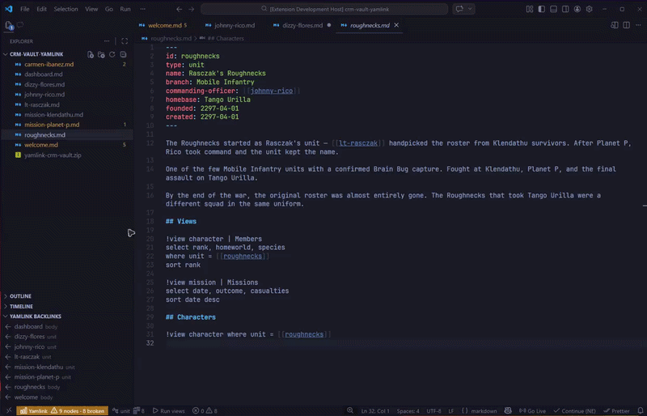
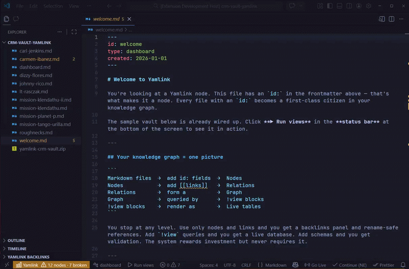
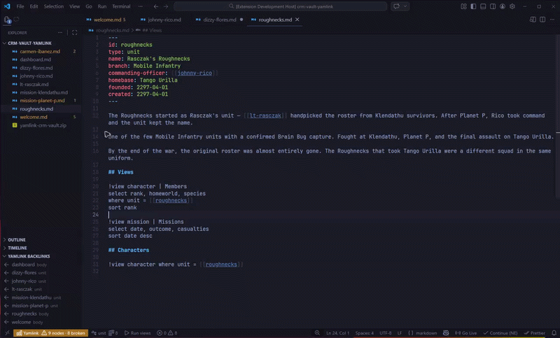

# Yamlink

**Structured knowledge for Markdown, inside VS Code.**

[](https://marketplace.visualstudio.com/items?itemName=yamlink.yamlink)   

Yamlink turns a folder of Markdown files into a structured knowledge system — a personal knowledge database stored as plain text, versioned with Git, and readable in any editor.

**Newest changes!**

**Live editable tables from `!view` blocks**


Write `!view` queries → run them from the status bar → edit YAML values directly in the table (changes save instantly).


**Smart Suggestions**


When Yamlink detects repeated backlink patterns (e.g. several missions linked via the same commander), it shows a suggestion in the status bar. Click → insert the ready-to-run query.


**Entity Hub**


Working on all noted with links → Entity Hub opens beside it, grouping inbound links by field (commander, unit, etc.), with search and collapse/expand.

---

## The Mental Model

```
Markdown files  →  add id: fields  →  Nodes
Nodes           →  add [[links]]   →  Relations
Relations       →  form a          →  Graph
Graph           →  queried by      →  !view blocks
!view blocks    →  render as       →  Live tables
```

That's the whole system. Files become nodes when they get an ID. Nodes become connected when they reference each other with `[[wikilinks]]`. The connections form a graph. `!view` blocks query that graph. Results render as interactive, editable tables — live in your documents, updating on every save.

**You stop at any level.** Use only nodes and links and you get rename-safe references and a backlinks panel. Add views and you get a live database. Add schemas and you get validation. The system rewards investment but never requires it.

---

## The Core Idea

Each Markdown file declares a canonical `id:` in YAML frontmatter. That ID is permanent — links stay valid even if files are renamed or moved across folders.

```yaml
---
id: johnny-rico
type: character
unit: [[roughnecks]]
rank: Private
created: 2297-01-15
---

Johnny Rico, Mobile Infantry. Volunteered after Federation graduation.
Served under [[lt-rasczak]] before assuming command of the Roughnecks.
```

Type `[[` anywhere and autocomplete suggests every node in your vault, filtered by type when context makes it clear. Hover over any link to preview the node. `Ctrl+Click` to navigate. Change an `id:` and Yamlink finds every reference and offers to update them all.

---

## Install

Search **"Yamlink"** in the VS Code Extensions panel, or:

```
https://marketplace.visualstudio.com/items?itemName=yamlink.yamlink
```

On first activation, open `welcome.md` in your workspace for a guided tour.

---

## Quick Start

**1. Give a file an identity.**

Add frontmatter with an `id:` to any Markdown file, or run `Yamlink: Create Node` from the Command Palette.

```yaml
---
id: dizzy-flores
type: character
unit: [[roughnecks]]
rank: Private
created: 2297-01-15
---
```

**2. Link nodes together.**

Type `[[` and pick from the autocomplete list. In frontmatter, links are typed relations — named edges in your knowledge graph.

```yaml
---
id: mission-klendathu
type: mission
date: 2297-08-01
commander: [[johnny-rico]]
squad:
  - [[dizzy-flores]]
  - [[ace-levy]]
  - [[sugar-watkins]]
outcome: catastrophic-failure
---

The Battle of Klendathu. The Federation's first major offensive.
Poorly planned, badly executed. Roughnecks extracted under fire.
```

**3. Open the backlinks panel.**

Open `johnny-rico.md`. The **Yamlink Backlinks** panel shows every file that links to Rico — `mission-klendathu` via `commander`, `dizzy-flores` via a body mention, and more as your vault grows.

**4. Query your data.**

Add a `!view` block to any file, then click **▶ Run views** in the status bar:

```
!view mission where commander = [[johnny-rico]]
select date, outcome
sort date desc
```

A panel opens beside your editor with a live, sortable table. Double-click any cell to edit it. Changes write back to the source file instantly.

**5. Let Yamlink suggest structure.**

Once three or more missions all link to Rico via `commander`, Yamlink shows a Code Action on his file: **"Add view — 3 missions linked via commander."** Click it. The query is written for you and appended to the document.

---

## Features

### View Panel & Query Language

Write `!view` blocks inside any Markdown file. Multiple blocks become tabs.

```
!view character | Roughnecks
select rank, unit, species
where unit = [[roughnecks]]
sort rank

!view mission | Missions
select date, commander, outcome
sort date desc
limit 10
```

**Query clauses:**

| Clause | Example | Purpose |
|--------|---------|---------|
| `select` | `select name, rank, unit` | Choose and order columns |
| `where =` | `where unit = [[roughnecks]]` | Filter by exact field value |
| `where contains` | `where notes contains arachnid` | Substring filter |
| `sort` | `sort date desc` | Sort ascending or descending |
| `limit` | `limit 5` | First N rows after sort |

**Panel interactions:** click an ID to open the file, double-click a cell to edit it inline, search to filter rows, click column headers to sort. All edits write back to frontmatter in the source file.

---

### Entity Hub

Open a node with backlinks and press the status bar item to open its Hub. Every node that links to this one is shown, grouped by the relation field it came through — sortable tables, global search, collapsible sections.

Rico's hub, for example, shows one section for `commander` (missions he led), one for `squad-leader` (operations he commanded), and one for `body` (files that mention him in prose). Body mentions start collapsed — they are weaker connections than structured relations.

---

### Vault Health

The health panel gives you a live overview of your entire vault: node count, edge count, broken links, orphan nodes, types, and a 0–100 health score. Click any stat to navigate to the relevant list or open a filtered view.

---

### Diagnostics

Yamlink validates your vault as you type.

| Diagnostic | Severity | Meaning |
|------------|----------|---------|
| `yamlink.missingId` | Hint | File has no `id:` — not indexed |
| `yamlink.duplicateId` | Warning | Two files share the same `id:` |
| `yamlink.brokenLink` | Warning | Body `[[link]]` points to nothing |
| `yamlink.brokenRelation` | Warning | Frontmatter `[[link]]` points to nothing |
| `yamlink.unknownType` | Info | `type:` not seen in any other node |
| `yamlink.missingRequiredField` | Warning | Schema-required field absent |

Use `Ctrl+.` on any diagnostic for a Quick Fix. Broken links offer to create the missing node, inferring the correct type from context.

---

### Rename Propagation

Change an `id:` and save. Yamlink scans the vault, counts affected files, and asks for confirmation. Apply directly or preview the diff first. Every change can be reverted. References are never silently broken.

---

### Schemas (Optional)

Schemas are nodes with `type: schema` that define the expected structure for a type. They add field validation, smarter completions, and better type inference in Quick Fixes — but they are never required. Start without them. Add them when consistency matters.

```yaml
---
id: schema-character
type: schema
target: character
fields:
  unit:
    type: relation
    target: unit
    required: false
  rank:
    type: string
    required: false
---
```

---

## ID Rules

```
johnny-rico          ✓
mission_klendathu    ✓
Johnny Rico          ✗  spaces not allowed
note#1               ✗  special characters not allowed
```

Letters, numbers, hyphens, underscores only. The same rule applies to frontmatter field names.

---

## Philosophy

**Your vault is a folder.** Plain Markdown files with standard YAML frontmatter. Open them in any editor, sync them anywhere, commit them to Git. Disable Yamlink and nothing changes.

**Identity is separate from filename.** File paths are cosmetic. The `id:` field is permanent. Reorganize your folder structure freely without breaking a single link.

**Structure emerges, it is not designed.** Types come from whatever `type:` values you use. Schemas are optional precision tools, not a prerequisite. The graph builds from the connections you naturally make.

**Features live in our own layer.** The core engine — graph, index, query runner, schema system — has zero VS Code dependency. It is portable to a CLI, a desktop app, or a web service without rewriting any logic.

---

## Sample Vault

A sample vault is included with the extension under `sample/`. It contains a small Starship Troopers knowledge graph — characters, units, missions, and relations — with working `!view` queries so you can see the system in action immediately.

To open it: copy the `sample/` folder contents into any workspace folder, open VS Code, and click **▶ Run views** on `dashboard.md`.

---

## Roadmap

**0.2.0 — Dizzie** _(current)_
View panel · Query language · Entity Hub · Vault Health · Schemas · Query suggestions · Inline editing · Rename propagation

**0.3.0 — Stabilization**
Incremental indexing · Performance at scale · Hover tooltips in views · Schema-driven column order

**0.4.0 — Navigation**
Graph visualization · Task aggregation · Calendar view

**0.5.0 — Platform**
Aggregations · Multi-condition where · CLI access

---

**Local-first. Git-native. No lock-in.**